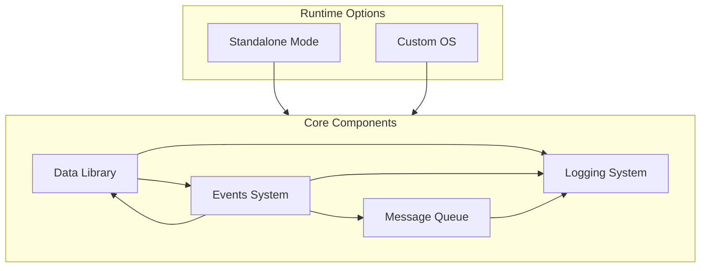

# Edge Flow

Edge Flow is a robust framework for building efficient, safe, and secure IoT/Edge computing applications in Rust. It provides a comprehensive suite of tools and libraries for handling data processing, event management, messaging, and logging in distributed IoT environments.

[](https://opensource.org/licenses/MIT)

## Architecture



## Features

- 🚀 **High Performance**: Built in Rust for maximum efficiency and safety
- 🔄 **Event-Driven**: First-class support for event driven patterns
- 📦 **Language Agnostic**: Seamless integration with C, Go, Zig, and Python
- 📊 **Rich Metadata**: Comprehensive data enrichment and tracking
- 📝 **Advanced Logging**: Structured logging with context preservation
- 🔍 **Full Observability**: Tracing and metrics built-in
- 🔒 **Security-First**: Rust's safety guarantees extended to the entire system

## Project Structure

``` plaintext
edge-flow/
├── data/           # Data models and validation
├── events/         # Event sourcing and management
├── logs/           # Logging and tracing system
├── messaging/      # Message queue and pub/sub
├── macros/         # Utility macros
└── os/             # Custom OS (future)
```

## Getting Started

```rust
use edge_flow::prelude::*;

#[derive(Data)]
struct Temperature {
    value: f64,
    unit: String,
}

#[derive(Event)]
struct TemperatureReading(Temperature);

fn main() -> Result {
    // Initialize the system
    let edge = EdgeFlow::init()?;
    
    // Create and publish a temperature reading
    let temp = Temperature::new(25.5, "celsius");
    let event = TemperatureReading::new(temp);
    
    edge.publish("sensors/temperature", event)?;
    
    Ok(())
}
```

## Documentation

- [Introduction](docs/intro.md)
- [Messaging](docs/messaging/docs.md)

## Contributing

Contributions are welcome!

## License

This project is licensed under the MIT License - see the [LICENSE](LICENSE) file for details.
